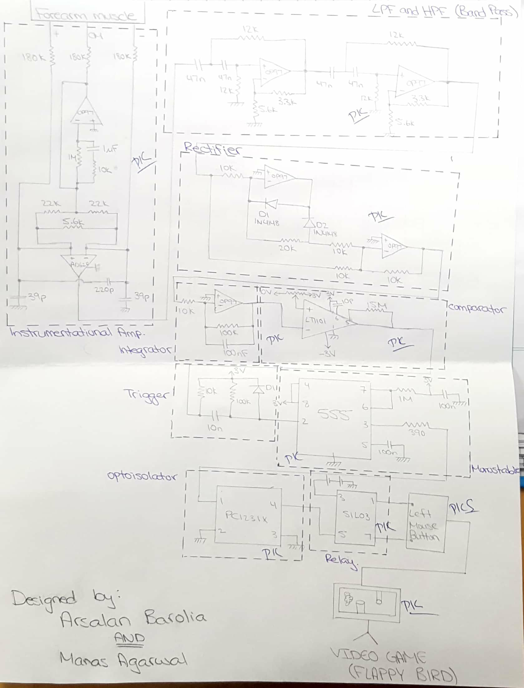
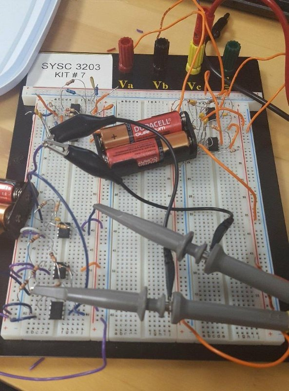
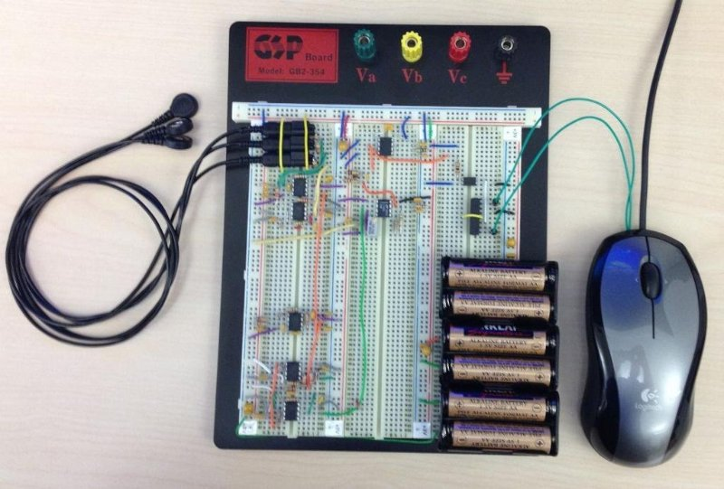

# Muscle Powered Flappy Bird

> Controlling the input of the birds jump by flexing the muscles in your wrist.

---

### Table of Contents

- [Description](#description)
- [Demo](#demo)
- [Design and Wiring](#design-and-wiring)
- [Contributions](#contributions)
- [Author Info](#author-info)

---

## Description

When Flappy Bird was first released, it was so popular the creator removed it from the appstores to avoid unwanted publicity. Thus, we built and re-designed the game such that it has a circuit interface that amplifies an electromyogram (EMG) signal. This signal is recieved each time the subject flexes thier muscle and used as an input to make the bird navigate through the pipes.

[Back To The Top](#project)

---

## Demo

 

The demonstartion clip can also be viewed on Youtube by clicking [here.](https://www.youtube.com/watch?v=TGAkV-Wh9EQ)

[Back To The Top](#project)

---

## Design and Wiring

 

 

 

[Back To The Top](#project)

---

## Contributions

<h4> Manas Agarwal</h4>

- LinkedIn - [https://ca.linkedin.com/in/manas-agarwal-](https://ca.linkedin.com/in/manas-agarwal-)
- Github - [https://github.com/AgarwalManas](https://github.com/AgarwalManas)

[Back To The Top](#project)

---

## Author Info

<h4> Arsalan Barolia</h4>

- LinkedIn - [https://www.linkedin.com/in/arsalanbarolia/](https://www.linkedin.com/in/arsalanbarolia/)
- Website - [Enter domain here](enter domain here)

[Back To The Top](#project)

---
